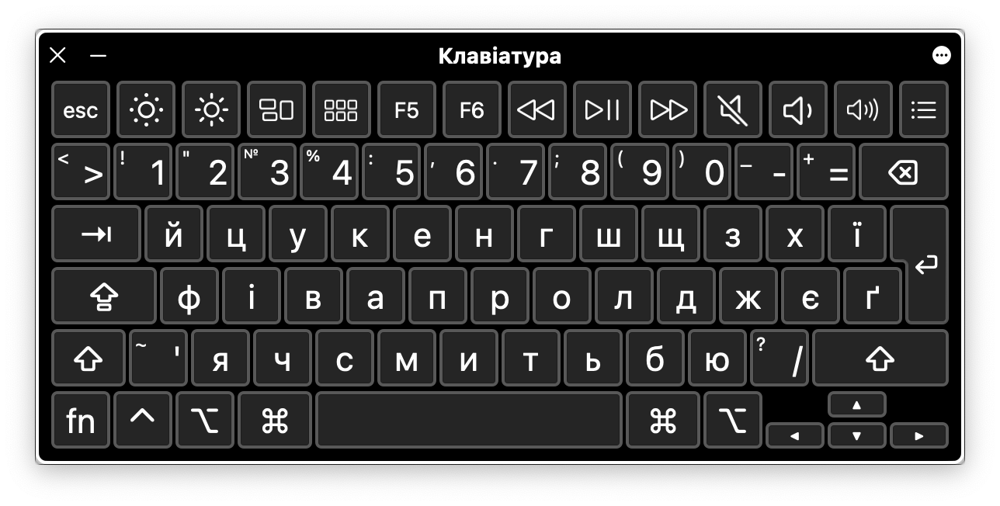

# ua-keylayout-alt
Alternative Ukrainian keyboard layout for Mac OS

--------

This layout is based on Ukrainian Traditional keyboard layout. 

Changes:

 - symbols `і` & `и` are swapped

 

 Created using Ukulele with love from Ukraine.